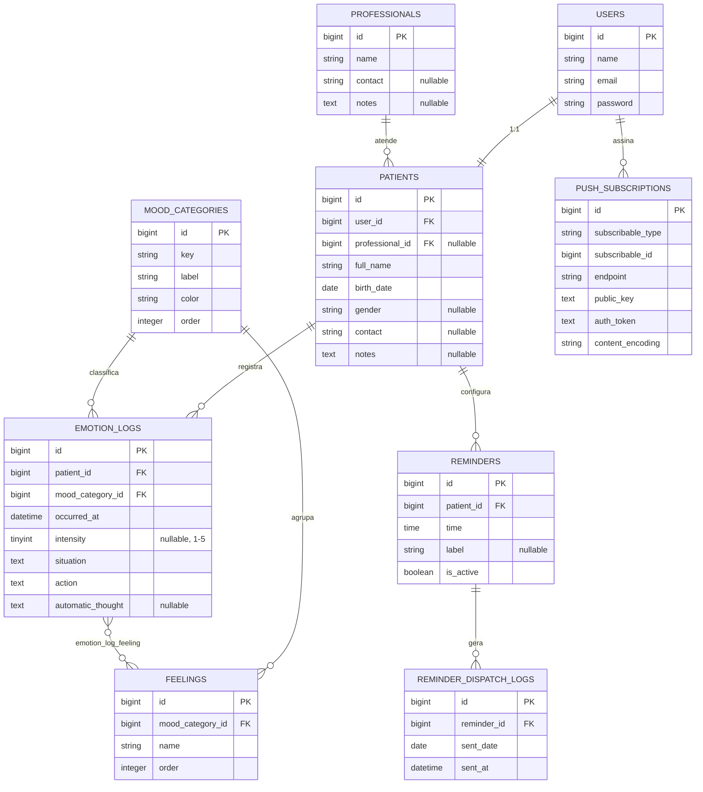

# 02 — Modelo de Dados

## 1. Diagrama ER

## 2. Detalhamento das tabelas

### `users` (padrão Breeze, sem alteração de schema)
Campos padrão do Laravel (`name`, `email`, `email_verified_at`, `password`, `remember_token`, timestamps).

### `patients`
| Campo | Tipo | Regras |
|---|---|---|
| `user_id` | FK → users, unique | 1:1 — cada usuário tem exatamente um paciente associado |
| `professional_id` | FK → professionals, nullable | psicóloga vinculada; pode ficar em branco inicialmente |
| `full_name` | string(150) | obrigatório |
| `birth_date` | date | obrigatório — usado para exibir idade calculada (evita idade "presa" desatualizando com o tempo) |
| `gender` | string(30), nullable | livre ou lista curta (Feminino/Masculino/Prefiro não informar/Outro) |
| `contact` | string(100), nullable | telefone ou e-mail alternativo, opcional |
| `notes` | text, nullable | observações livres (ex.: condições relevantes) |

> Decisão: usar `birth_date` em vez de armazenar `age` diretamente — idade é sempre derivada (`Carbon::parse($birth_date)->age`), evitando dado que fica desatualizado.

### `professionals`
| Campo | Tipo | Regras |
|---|---|---|
| `name` | string(150) | obrigatório |
| `contact` | string(100), nullable | telefone/e-mail da psicóloga |
| `notes` | text, nullable | ex.: especialidade, CRP |

Entidade própria (não texto livre no paciente) — decisão confirmada com o usuário. Justificativa: cabeçalho do PDF exportado usa `professional.name`; se o paciente trocar de profissional, o histórico antigo mantém o profissional correto de cada época (ao gravar `professional_id` teria que ser snapshot por log se isso importar — **v1 assume 1 profissional "atual"**, sem histórico de troca; ver backlog no doc 12 se isso precisar mudar).

### `mood_categories` (seed fixo, não editável por UI na v1)
| Campo | Tipo |
|---|---|
| `key` | string(20), unique — `positivo` / `neutro` / `negativo` |
| `label` | string(30) — rótulo exibido |
| `color` | string(20) — token de cor (ex.: `green`, `gray`, `red`) |
| `order` | integer — ordem de exibição |

### `feelings` (seed fixo)
| Campo | Tipo |
|---|---|
| `mood_category_id` | FK → mood_categories |
| `name` | string(50) |
| `order` | integer |

### `emotion_logs` (tabela central)
| Campo | Tipo | Regras |
|---|---|---|
| `patient_id` | FK → patients | obrigatório |
| `mood_category_id` | FK → mood_categories | obrigatório |
| `occurred_at` | datetime | obrigatório, default `now()` no momento da criação, editável pelo usuário |
| `intensity` | tinyint unsigned, nullable | 1 a 5, opcional |
| `situation` | text | obrigatório |
| `action` | text | obrigatório |
| `automatic_thought` | text, nullable | opcional (5º passo pulável) |

Índices: `(patient_id, occurred_at)` para acelerar histórico/filtros por período; `(patient_id, mood_category_id)` para agregações do dashboard.

### `emotion_log_feeling` (pivot)
| Campo | Tipo |
|---|---|
| `emotion_log_id` | FK → emotion_logs |
| `feeling_id` | FK → feelings |

Chave única composta `(emotion_log_id, feeling_id)`. Seleção múltipla de sentimentos por registro (decisão confirmada — TCC tipicamente envolve emoções simultâneas).

### `reminders`
| Campo | Tipo | Regras |
|---|---|---|
| `patient_id` | FK → patients | obrigatório |
| `time` | time | obrigatório (ex.: `08:00:00`) |
| `label` | string(50), nullable | ex.: "Lembrete da manhã" |
| `is_active` | boolean, default true | |

Regra de negócio (validada na Form Request/Service, não no schema): **máximo de 3 lembretes ativos por paciente**.

### `reminder_dispatch_logs`
| Campo | Tipo | Regras |
|---|---|---|
| `reminder_id` | FK → reminders | |
| `sent_date` | date | data (sem hora) do disparo |
| `sent_at` | datetime | timestamp exato do envio |

Constraint única `(reminder_id, sent_date)` — garante idempotência: mesmo que o comando `reminders:dispatch` rode mais de uma vez no mesmo dia para o mesmo lembrete (cron atrasado, reinício do servidor), o envio duplicado é evitado por uma checagem `whereDate()` prévia + `catch` de `UniqueConstraintViolationException` na corrida rara (ver doc 10, seção 6 — `firstOrCreate` direto com uma coluna `date` cast se mostrou arriscado por causa de serialização inconsistente entre bancos).

### `push_subscriptions`
Gerada automaticamente pela migration do pacote `laravel-notification-channels/webpush` (`php artisan vendor:publish` + `migrate`). Estrutura polimórfica padrão do pacote, associada ao model `User`.

### `share_links` e `share_link_accesses` (doc 13)

Adicionadas no módulo de compartilhamento com a psicóloga (pós-MVP):

| Tabela | Campos principais |
|---|---|
| `share_links` | `patient_id` (único — 1 link por paciente), `token` (string aleatória, único), `pin_hash` (bcrypt do PIN de 6 dígitos), `expires_at` |
| `share_link_accesses` | `patient_id` (não `share_link_id` — sobrevive a revogação/regeneração do link), `ip_address`, `user_agent`, `accessed_at` |

Gerar um novo link é um `updateOrCreate` por `patient_id`: substitui token/PIN/expiração da mesma linha, invalidando o link anterior automaticamente.

## 3. Ordem das migrations

1. `create_professionals_table`
2. `create_patients_table` (depende de `users` já existir via Breeze, e de `professionals`)
3. `create_mood_categories_table`
4. `create_feelings_table`
5. `create_emotion_logs_table`
6. `create_emotion_log_feeling_table`
7. `create_reminders_table`
8. `create_reminder_dispatch_logs_table`
9. Migration do pacote `webpush` (publicada via `vendor:publish`)
10. Migrations de `sessions` e `cache` (via `php artisan session:table` e `php artisan cache:table`, exigidas pelos drivers `database`)

## 4. Seeders

- **`MoodCatalogSeeder`**: popula `mood_categories` e `feelings` com o catálogo definido no doc 00 (seção 8). Roda sempre, inclusive em produção (`db:seed --class=MoodCatalogSeeder` faz parte do primeiro deploy).
- **`DemoUserSeeder`** (dev only, não roda em produção): cria o usuário único de desenvolvimento + um `Patient` de teste, para não precisar cadastrar manualmente toda vez que resetar o banco local.
- Criação do usuário/paciente **real** em produção: feita uma única vez via `php artisan make:filament-user`-like custom command (ver doc 04) — não via seeder genérico, para não arriscar recriar dados reais em um `db:seed` acidental.

## 5. Decisões de design registradas

| Decisão | Confirmado |
|---|---|
| Intensidade (1-5) no registro emocional | ✅ Sim, campo opcional |
| Pensamento automático como 5º passo | ✅ Sim, opcional/pulável |
| Psicóloga como entidade própria (`professionals`) | ✅ Sim |
| Seleção múltipla de sentimentos por registro | ✅ Sim (N:N) |
| Idade armazenada como campo fixo vs. calculada de `birth_date` | Calculada a partir de `birth_date` (evita dado desatualizado) |
| Histórico de troca de profissional por paciente | Fora do escopo v1 — assume-se 1 profissional atual; ver backlog |
